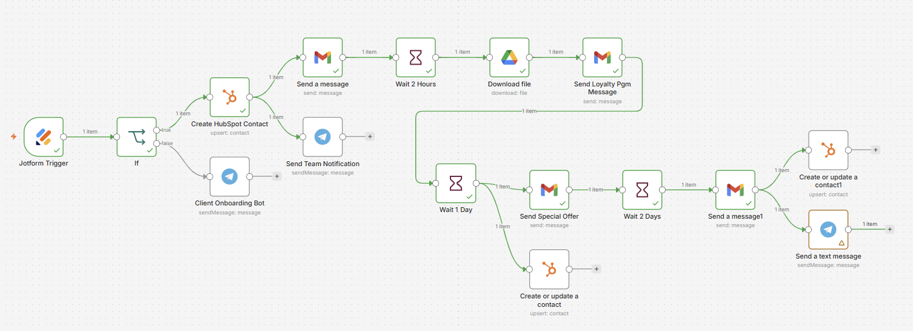

# Client Onboarding Automation

## What It Does
This workflow automates onboarding and communication in a loyalty program; turns a first-time guest into a repeat visitor, or a new customer signup into real loyalty.

## Workflow Preview

## Tools & Integrations
- 

## How It Works
1. Trigger: Accepts loyalty program signups
2. The client submits a form with their details, such as name and email.
3. Validates the data - If required fields are missing or filled incorrectly, the system immediately notifies the team and stops the process.
4. Adds the client to the CRM - The client is automatically created in the CRM with a loyalty program participant status.
5. Sends a welcome message - The client instantly receives a welcome email or message without any manual work.
6. Launches an onboarding message sequence. After scheduled delays, the system:
- Explains how the loyalty program works.
- Sends a PDF, guide, or program rules.
- Reminds the client about bonuses and benefits.
- Updates the client status during onboarding
7. The CRM shows the client’s current stage, from new to in process to completed.
8. Notifies the team - The team is informed about:
- New loyalty program members.
- Data validation errors.
- Successful onboarding completion.

## Use Case / Problem Solved
In a restaurant, client onboarding turns a new guest into a returning one. After signup, the client needs to know:
- How the loyalty program works.
- How they earn points or bonuses.
- What rewards are available.
- When and how they can use them.
If this is unclear, the loyalty program fails. People sign up. Then they forget. 

Automated client onboarding is needed to:
- Welcome the guest immediately.
- Explain the rules clearly.
- Send reminders and benefits at the right time.
- Keep the restaurant team informed.

## Files
| File | Description |
|------|-------------|
| `workflow-clientOnboarding.json` | n8n workflow export (import directly into n8n) |
| `workflow-screenshot-n8n-clientOnboarding.png` | Visual overview of the workflow |

## How to Use
1. Download `workflow-clientOnboarding.json`
2. In n8n, go to **Workflows → Import from File**
3. Add your own credentials for GoogleSheets and Gemini
4. Activate and test

