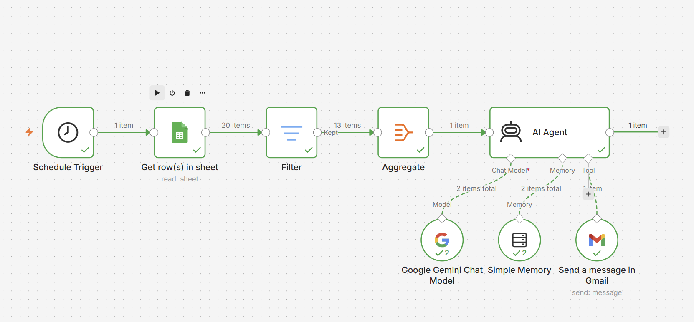

# Inventory Check

## What It Does
Automated inventory monitoring system using n8n, Google Sheets, and Google Gemini. 

## Workflow Preview

## Tools & Integrations
- **n8n** — workflow automation
- **Google Sheets** — store inventory information
- **Google Gemini** — communicates inventory numbers and alerts

## How It Works
1. A Schedule Trigger fires on a scheduled, periodic intervals.
2. The Trigger retrieves rows from a Google Sheet.
3. A Filter normalizes the datasets for syntax and character case, then stores it for use.
4. The data is aggregated so the process runs once across multiple items.
5. An AI Agent, using the Google Gemini chat model, evaluates and communicates whether inventory is low or available.
6. Simple Memory stores the inventory history, ensuring the current inventory isn't overwritten by another inventory request.
7. The AI Agent sends a Gmail message confirming the actions taken.

## Use Case / Problem Solved
This automation prevents stockouts, reduces manual checks, and improves purchasing efficiency.

## Files
| File | Description |
|------|-------------|
| `workflow-inventoryCheck.json` | n8n workflow export (import directly into n8n) |
| `workflow-screenshot-n8n-inventoryCheck.png` | Visual overview of the workflow |

## How to Use
1. Download `workflow-inventoryCheck.json`
2. In n8n, go to **Workflows → Import from File**
3. Add your own credentials for Gemini and Gmail
4. Activate and test
