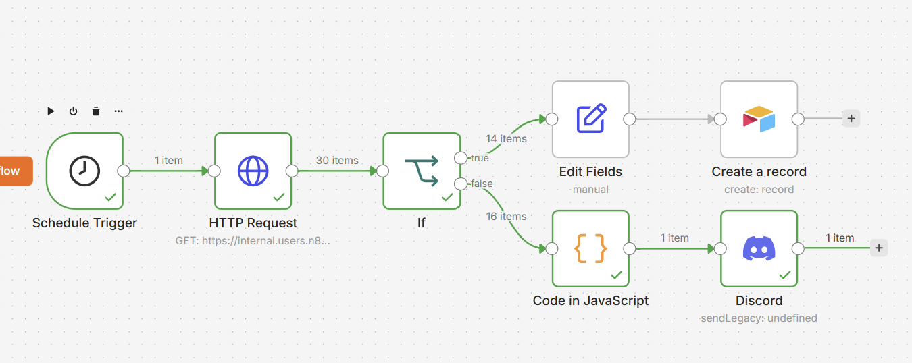

# Order Metrics - Discord Chat

## What It Does
ERP Order Analytics & Reporting Automation (n8n)

## Workflow Preview

## Tools & Integrations
- **n8n** — workflow automation
- **HTTP Request Webhook** - Sets up API key and auth credentials to update database with web data
- **AirTable** - stores structured data
- **Code in JavaScript** - sums up all orders booked to see revenue
- **Discord** — Sends message to internal chat channel

## How It Works
1. Schedule Trigger for system filters processing orderstor
2. Stores structured data in Airtable
3. Calculates weekly order totals and revenue using JavaScript
4. Automatically sends performance summaries to Discord.

## Use Case / Problem Solved
Automation workflow using n8n that connects to a custom ERP system via HTTP request. This workflow provides real-time order tracking, structured data storage, and automated reporting for better operational visibility and decision-making.

## Files
| File | Description |
|------|-------------|
| `workflow-orderMetricsDiscord.json` | n8n workflow export (import directly into n8n) |
| `workflow-screenshot-n8n-orderMetricsDiscord.png` | Visual overview of the workflow |

## How to Use
1. Download `workflow-orderMetricsDiscord.json`
2. In n8n, go to **Workflows → Import from File**
3. Add your own credentials for HTTP Request, Airtable, and Discord
4. Activate and test
